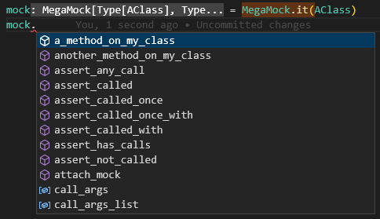
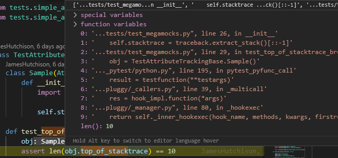

# Features List

## Default behavior is to autospec mocks and create instances

```python
foo = MegaMock.it(Foo)  # foo is a mock instance of Foo

foo.some_method(wrong, args)  # raises error
```

```python
FooMock = MegaMock.the_class(Foo)  # FooMock is a type
```

## Patch objects by simply passing them in. Patches start automatically

```python
MegaPatch.it(Foo)
```


## When patch is used, all locations are patched

```python
# module A is patched
from my_module import Foo

# module B is also patched
import my_module

my_module.Foo
```

## Restore real logic

```python
Mega(my_mock.some_method).use_real_logic()
```

## Static type hinting support



## PyTest plugin

```toml
[tool.pytest.ini_options]
addopts = "-p megamock.plugins.pytest"
```

## For pytest, assert using the assert statement instead of assert functions

```python
assert Mega(my_mock.some_method).called_with(1, 2, 3)
```

## See where assignments and spied attribute access happens in the stack



## Access helpers

```python
my_patch = MegaPatch.it(Foo)
my_patch.megainstance  # the instance (instead of class) mock

# context manager helpers
my_patch.set_context_manager_return_value(1)
my_patch.set_context_manager_side_effect(Exception("IO Error!"))
my_patch.set_context_manager_exit_side_effect(Exception("Failed to close transaction!"))
```

## Human friendly names via `meganame`

```python
returned = my_mock()
expected = a_different_mock()

assert returned == expected, f"Expected {returned.meganame} got {expected.meganame}"
```
