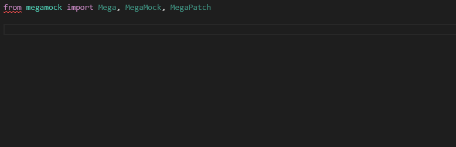

# **MegaMock** - _The Developer Experience Upgrade for Python Mocking_

Pew pew! Sane defaults for mocking behavior! Patch objects, variables, attributes, etc by passing in the thing in question, rather than passing in dot-delimited path strings! Create tests faster than ever!

Supported Python Versions: 3.10+
### Installation

Pip installation:
```
pip install megamock
```

[poetry](https://python-poetry.org/) (as a development dependency):
```
poetry add megamock --group=dev
```

# Why Use MegaMock? (short version)
MegaMock is a library that provides a better interface for mocking and patching in Python. Its version
of patch doesn't have any gotchas based on how you import something, and it also automatically
creates mocks using best practices. Additionally, the generated mock types are unions of the mocked object
and `MegaMock`, allowing you to better leverage your IDE's autocomplete.



Mock:

```python
class_mock = mock.create_autospec(ClassICareAbout, instance=True)
# cmd / alt clicking on "method_call" doesn't direct you to the definition
class_mock.method_call.return_value = "some value"

# can't simply cmd / alt click and go to ClassICareAbout
with mock.patch("some.hard.to.remember.and.long.dot.path.ClassICareAbout", class_mock) as mock_instance:
    do_something()
```

MegaMock:

```python
# cmd / alt clicking on ClassICareAbout takes you to the definition
patch = MegaPatch.it(ClassICareAbout)
mock_instance = patch.megainstance
# cmd / alt clicking on "method_call" directs you to the definition
mock_instance.method_call.return_value = "some value"

do_something()
```

# Why Use MegaMock? (long version)
MegaMock was created to address some shortcomings in the built-in Python library:
- Legacy code holds back "best practice" defaults, so many developers write sub-optimal mocks
  that allow things that should not be allowed. Likewise, writing better mocks are more work,
  so there's a tendency to write simpler code because, at that point in time, the developer
  felt that is all that was needed. MegaMock's simple interface provides sane defaults.
- `mock.patch` is very commonly used, and can work well when `autospec=True`, but has the drawback that
  you need to pass in a string to the thing that is being patched. Most (all?) IDEs do not properly
  recognize these strings as references to the objects that are being patched, and thus automated
  refactoring and reference finding skips them. Likewise, automatically getting a dot referenced path
  to an object is also commonly missing functionality. This all adds additional burden to the developer.
  With `MegaPatch`, you can import an object as you normally would into the test, then pass in thing
  itself you want to patch. This even works for methods, attributes, and nested classes! Additionally, your IDE's autocomplete for attributes
  will work in many situations as well!
- `mock.patch` has a gotcha where the string you provide must match where the reference lives.
  So, for example, if you have in `my_module.py`: `from other_module import Thing`, then doing
  `mock.patch("other_module.Thing")` won't actually work, because the reference in `my_module` still
  points to the original. You can work around this by doing `import other_module` and referencing `Thing`
  by `other_module.Thing`. MegaMock does not have this problem, and it doesn't matter how you import.

## Features

See the [full features list](FEATURES.md).
## Example Usage

### Production Code
```python
from module.submodule import MyClassToMock


def my_method(...):
    ...
    a_thing = MyClassToMock(...)
    do_something_with_a_thing(a_thing)
    ...


def do_something_with_a_thing(a_thing: MyClassToMock) -> None:
    result = a_thing.some_method(...)
    if result == "a value":
        ...
```

### Test Code
```python
from megamock import MegaPatch
from module.submodule import MyClassToMock


def test_something(...):
    patch = MegaPatch.it(MyClassToMock.some_method)
    patch.return_value = "a value"

    my_method(...)
```

## Documentation

### Usage (pytest)

With [pytest](https://pytest.org), MegaMock is easily leveraged by using the included pytest plugin. You can use it by adding `-p megamock.plugins.pytest`
to the command line.

Command line example:
```
pytest -p megamock.plugins.pytest
```

`pyproject.toml` example:
```toml
[tool.pytest.ini_options]
addopts = "-p megamock.plugins.pytest"
```

The pytest plugin also automatically stops `MegaPatch`es after each test. To disable this behavior, pass in the `--do_not_autostop_megapatches`
command line argument. If `pytest-mock` is installed, the default mocker will be switched to the `pytest-mock` `mocker`.

### Usage (other test frameworks)

If you're not using the pytest plugin, import and execution order is important for MegaMock. When running tests, you will need to execute the `start_import_mod`
function prior to importing any production or test code. You will also want it so the loader is not used in production.

-------------------

**Core Classes**

`MegaMock` - the primary class for a mocked object. This is similar to `MagicMock`. Use `MegaMock.it(MyObject)` to make `MyObject` the [spec](https://docs.python.org/3/library/unittest.mock.html#unittest.mock.create_autospec).

`MegaPatch` - the class for patching. This is similar to `patch`. Use `MegaPath.it(MyObject)` to replace new instances of the `MyObject` class.

`Mega` - helper class for accessing mock attributes without having to memorize the due to lost type inference. Use `Mega(some_megamock)`.
Note that the `assert_` methods, such as `assert_called_once`, is now `called_once` and returns a boolean. The assertion error
is stored in `Mega.last_assertion_error`.

--------------------

Dependency injection example:
```python

from megamock import MegaMock

def test_something(...):
    manager = MegaMock.it(MyManagerClass)
    service = SomeService(manager)
    ...
```

MegaPatch example:
```python
from elsewhere import Service

from megamock import MegaPatch

def test_something(...):
    patched = MegaPatch.it(Service.make_external_call)
    patched.return_value = SomeValue(...)
    service = SomeService(...)

    code_under_test(service)
    ...
```

`MegaMock` objects have the same attributes as regular `MagicMock`s plus `megamock` and `megainstance`
For example, `my_mega_mock.megamock.spy` is the object being spied, if set. `my_class_mock.megainstance` is the instance returned when the class is instantiated.

The [guidance document](GUIDANCE.md) is available to provide in-depth information on using mocking and MegaMock. Continuing reading to
quickly jump in to examples.

-----------------------

### Learning By Example

All examples below have the following imports:

```python
from my_module import MyClass
from megamock import Mega, MegaMock, MegaPatch
```

Creating a mock instance of a class:

```python
mock_instance = MegaMock.it(MyClass)
```

Creating a mock class itself:

```python
mock_class = MegaMock.it(MyClass, instance=False)
```

Spying an object:

```python
my_thing = MyClass()
spied_class = MegaMock(spy=my_thing)

# ... do stuff with spied_class...

Mega(spied_class.some_method).call_args_list  # same as wraps

# check whether a value was accessed
# if things aren't as expected, you can pull up the debugger and see the stack traces
assert len(spied_class.megamock.spied_access["some_attribute"]) == 1

spy_access_list = spied_class.megamock.spied_access["some_attribute"]
spy_access: SpyAccess = spy_access_list[0]
spy_access.attr_value  # shallow copy of what was returned
spy_access.stacktrace  # where the access happened
spy_access.time  # when it happened (from time.time())
spy_access.top_of_stacktrace  # a shorthand property intended to be used when debugging in the IDE
spy_access.format_stacktrace()  # return a list of strings for the stacktrace
spy_access.print_stacktrace()  # display the stacktrace to the console
```


Patching a class:

```python
mock_patch = MegaPatch.it(MyClass)

# the class itself
mock_patch.new_value

# the class instance
mock_patch.megainstance

# the return value of the __call__ method on the class
mock_patch.megainstance.return_value
```

Patching a class attribute:

```python
# temporarily update the max retries to 0
mega_patch = MegaPatch.it(MyClass.max_retries, new=0)
```

Patching a class method:

```python
mega_patch = MegaPatch.it(MyClass.my_method, return_value=...)
```

Alternatively:
```python
mega_patch = MegaPatch.it(MyClass.my_method)
mega_patch.mock.return_value = ...
```

```python
mega_patch = MegaPatch.it(MyClass.my_method)
mega_patch.new_value.return_value = ...
```

You can also alter the return value of your mock without creating a separate mock object first.

```python
mega_patch.return_value.user = SomeUser()
```

Working with `MegaPatch` and classes:

`mega_patch.new_value` is the class _type_ itself

```python
mega_patch = MegaPatch.it(MyClass)

mega_patch.new_value.x is MyClass.x
```

`mega_patch.return_value` is the class _instance_ returned. However, there is the property
`megainstance` which is preferred because it has better type hinting.

```python
mega_patch = MegaPatch.it(MyClass)

# instead of this, for which the static type is Any:
mega_patch.return_value is MyClass()

# use this, which has a static type of MegaMock | MyClass:
mega_patch.megainstance is MyClass()
```

Patching a module attribute:

```python
import my_module

MegaPatch.it(my_module.some_attribute, new=...)
```

Patching a method of a nested class:

```python
import my_module

MegaPatch.it(
    my_module.MyClass.MyNestedClass.some_method,
    return_value=...
)
```

Setting the return value:

```python
my_mock.my_method.return_value = "foo"
```

Turning on real logic:

```python
import my_module
from mega_mock import UseRealLogic

mega_patch = MegaPatch.it(my_module.SomeClass)
Mega(mega_patch.megainstance.some_pure_logic_method).use_real_logic()

do_something_that_invokes_that_function(...)
```

# Congrats on Reading This Far! Here's an Art Gallery!


Nobody said it was a big art gallery. Feel free to submit a PR that helps fix that. No artistic skill required.
